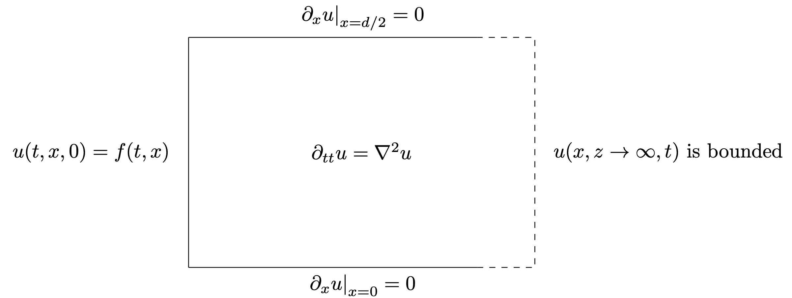

### pyTalbot

This project's aim is to plot the formation of the Talbot effect in the near field of an infinite periodic diffraction grating of Fourier coefficients $g_n$. This corresponds to the numeric part of the attached report.

## Requirements

In order to get all the python required libraries, you may run from the main folder
```
pip install -r requirements.txt
```

It is also necessary to compile the C++ libraries used for integration. For this you need GSL. You may install GSL from the terminal in Ubundu and Debian through `sudo apt install gsl` and on macOS through `brew install gsl`.

To compile the libraries, run the following from the main folder, where the file CMakeList.txt is,
```
mkdir build && cd build
cmake ..
make
make clean
```

In order to be able to create the video, it is indispensable to have [FFmpeg](https://www.ffmpeg.org/) installed.

You may install it from the terminal in Ubundu and Debian through `sudo apt install ffmpeg` and on macOS through `brew install ffmpeg`.

## The problem

This project plots the solution to the 2D wave equation

$$\partial_{tt} u = \partial_{xx} u + \partial_{yy} u + \partial_{zz} u$$

in the domain $0 \leq x <= d/2$, $z \geq 0$, $t \geq 0$ under the border conditions in $x$

$$\left.\partial_x u\right\vert_{x=0} = \left.\partial_x u\right\vert_{x=d/2} = 0, \tag{1.2}$$

the boundary conditions in $z$

$$u(t,x,0) = f(t,x) = \sin(\omega t)\theta(t)\, \chi(x/w), \tag{1.3}$$

and the initial conditions

$$u(t=0) = 0,\quad\text{and,}\quad \partial_t u(t=0) = 0. \tag{1.4}$$

All of this can be sumarised through the figure


## The solution

The solution to this problem can be written in closed form: 
... (4.8)
which is what we plot. The RHS is mostly straightforward to compute, although certain approximations must be made:
  - The most obvious, we have to introduce an $N$ at which we truncate the series. We usually want to take $N \gg \frac{d}{ \lambda}$ to make sure that we take into account all the oscillatory behaviour.
  - We have to numerically approximate the integral. In order to do this, we use Scipy's adaptative quadrature method, [quad](https://docs.scipy.org/doc/scipy/reference/generated/scipy.integrate.quad.html), which uses a technique from the Fortran library QUADPACK to compute the integral.

After calculating $u(t,x,z)$ on a grid, we plot it and make an .mp4 video to showcase the transient behaviour of the Talbot effect.

There is also the possibility to plot the state of the field at the final time considering the stationary approximation (see section 5 of the notes) and to compare its result to the transient case.


## Aknowledgements

This project was developped by Gabriel María Ybarra Marcaida under the supervision of [Luis Vega González](https://www.bcamath.org/en/people/bcam-members/lvega) during the authour's research internship at the [Basque Centre for Applied Mathematics](https://www.bcamath.org/en) in between November 2024 and February 2025.

The authour would like to thank @miguelfrndz and @pcardenal5 with their help with programming issues throughout the development of the project.